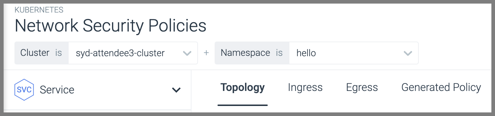
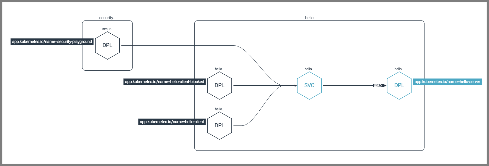
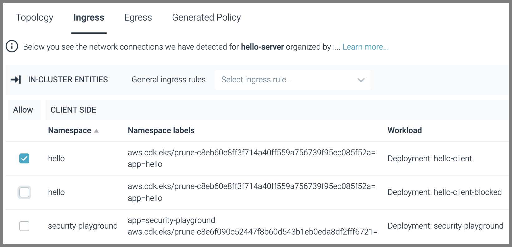
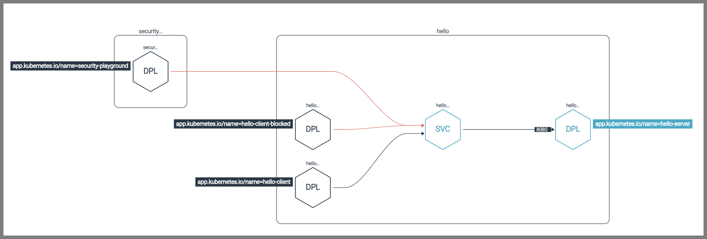
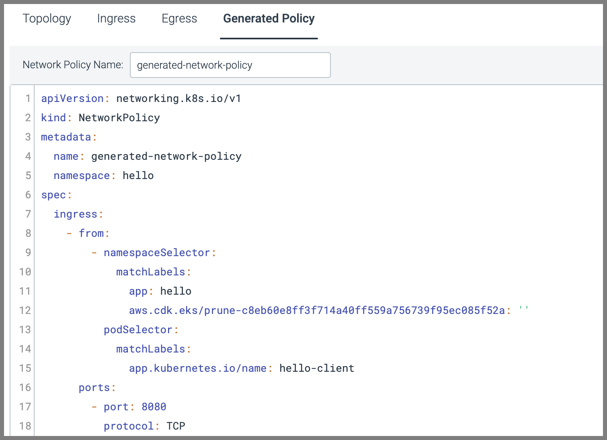
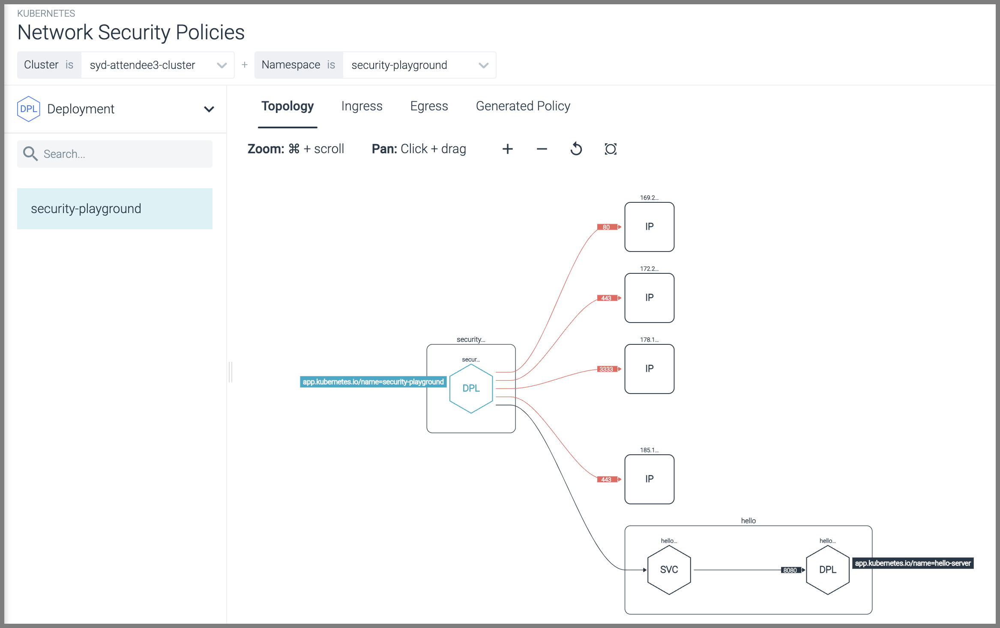
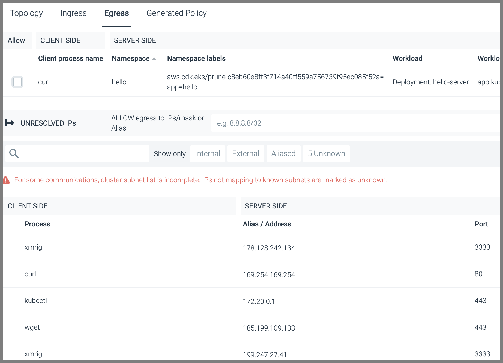
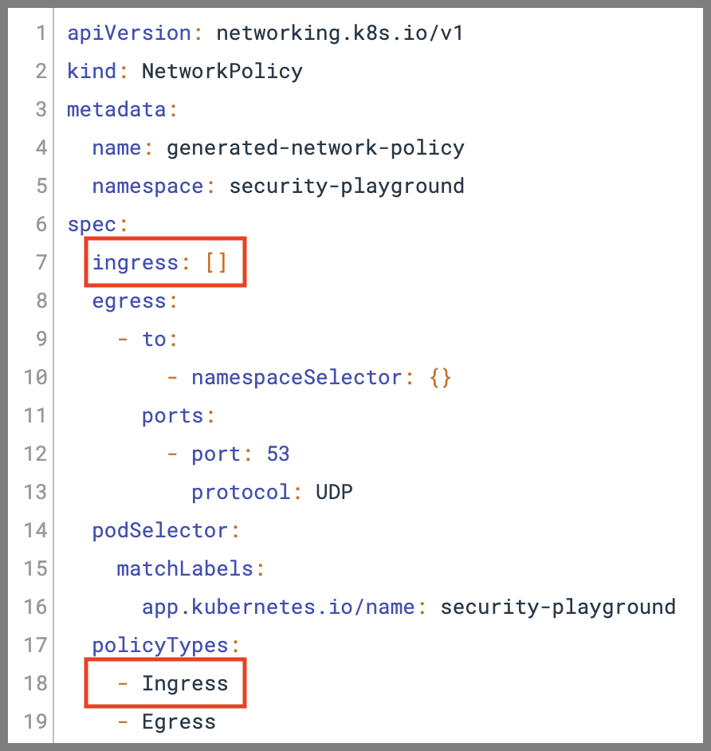

## Kubernetes native firewall (NetworkPolicies)

Kubernetes has a built-in firewall which you configure through YAML documents called [NetworkPolices](https://kubernetes.io/docs/concepts/services-networking/network-policies/). These can have rules not just based on IPs or CIDR blocks/ranges - but based on Kubernetes Namespaces and Labels. This is much more dynamic and easier to manage!

It is not enabled out-of-the-box on many Kubernetes distributions/offerings including EKS. For EKS, you need to [set a configuration option on their CNI cluster Add-on](https://docs.aws.amazon.com/eks/latest/userguide/cni-network-policy.html) (which we've done for you here today). These CNI providers basically configure a local firewall on each and every Kubernetes Node - and update them continually across all the Nodes to enforce the NetworkPolicies as required.

Even after installing/configuring a CNI to be able to enforce NetworkPolicies there aren't any by default - so every Pod can talk to every other Pod by default. So, you need to implement policies to restrict that traffic - with the most secure option being to flip to a default-deny and then specifically allow *everything* that is required. This can be a bit daunting adding them to existing environments as you'll worry that they make break things. This is where Sysdig can help.

### Using Sysdig to discover your traffic and generate NetworkPolicies

Sysdig's keeps track of all the network flows and works out the Kubernetes context/labels of everything involved. This allows us to show you the traffic we've seen as well as help you generate NetworkPolicies that would allow only that traffic. In our UI you can untick things we've seen if you don't want to allow them as well.

To explore this feature:

1. Run:

    ```bash
    sudo bash; cd ~
    ./06-01-example-curls-networkpolicy.sh
    ```

    and see how our security-playground Pod can reach hello-server (which is running in a different Kubernetes Namespace)
2. Open the Sysdig tab in your browser
3. Go to **Network** on the left
4. Pick your EKS cluster as well as the Namespace **hello** and the type **Service**
    1. 
5. In the right-hand pane we can see that the hello Namespace consists of:
    1. A backend that is made up of a service named hello-server and a deployment named **hello-server**
    2. Two frontend apps called **hello-server-client** and **hello-server-client-blocked** that talk to the **hello-server** backend service
    3. We can also see that our **security-playground** services were connecting to the backend as well (as there was a **curl** to do so in the exploit scripts we ran)
    4. 
6. Click the **Ingress** tab
7. Here you can untick anything we don't want talking to our hello-server service.
    1. Untick everything but **hello-server-client**
    2. 
8. Click back to **Topology** and now you'll see the things we are going to block with red lines (with the only allowed/black path being to hello-server-client)
    1. 
9. Click **Generated Policy** and copy all the contents to your clipboard
    1. 
10. Go back to your jumpbox terminal browser tab
11. Run the following:

    ```bash
    vi policy.yaml
    # Type `i` to go into insert mode
    # Paste it in there with a `Shift-Ctrl-V` on PC or a `Shift-Command-V` on Mac
    # Press Esc to leave insert mode then type `:wq` to save and exit
    ```

12. Type the following to apply it:

    ```bash
    kubectl apply -f policy.yaml
    ```

13. Run:

    ```bash
    ./06-01-example-curls-networkpolicy.sh
    ```

    again to see that it now cannot reach hello-server due to our new NetworkPolicy (it will timeout)

14. Run:

    ```bash
    kubectl logs deployment/hello-server-client-blocked -n hello
    ```

    to see the logs from the hello-server-client-blocked service showing that it too has now been blocked by the NetworkPolicy (wget: download timed out)
15. Run:

    ```bash
    kubectl logs deployment/hello-server-client -n hello
    ```

    to see the logs from the hello-server-client service showing it still **can** still reach hello-server like we intended

#### Controlling Network Egress - especially to the Internet

This isn't just useful for controlling the ingress to services like we just did with hello-server, but also for limiting egress - especially to the Internet - as well.

Let's look at how this could help with our insecure security-playground example from above:

1. Go back to the Sysdig browser tab
2. In the **Network** section choose the **security-playground** namespace and the **Deployment** object type
    1. 
3. Here you'll not only see the other side of the hello-server interaction (this deployment calling out to hello-server) - but also all the Internet IPs that it talked out to as we did our curls - to download apt packages and talk to the crypto miner pool etc.
4. You can generate a NetworkPolicy excluding all that Internet egress like we did above - go to the **Egress** tab
    1. We actually default to excluding all IPs/CIDRs outside the cluster (that is why the lines are red):
        1. Untick the hello-server so that security-playground won't be able to egress to that
        2. Note that it shows not just the IPs we were talking to but the process name that was talking to them.
            1. If you wanted to allow these you can click the checkmark with a plus icon to the right of them - and click that again to remove (when it turns into a checkmark with a minus)
    2. 
    3. This is another control that would prevent many of the things we did with our curls at the start!
5. Go to the Generated Policy tab
    1. Rather than use the Generated Policy as-is, we'll remove the Ingress line from the policyTypes so we can still reach the service first.
        1. Copy and paste this into a text editor and remove the Ingress lines and then copy that now Ingress-less policy to your clipboard
    2. 
6. Go back to your jumpbox terminal browser tab
7. Run the following:

   ```bash
   vi policy2.yaml
   # Type `i` to go into insert mode
   # Paste it in there with a `Shift-Ctrl-V` on PC or a `Shift-Command-V` on Mac
   # Press `Esc` to leave insert mode then type `:wq` to save and exit
   ```

8. Run the following to apply it:

    ```bash
    kubectl apply -f policy2.yaml
    ```

9. Re-run:

    ```bash
    ./01-01-example-curls.sh
    ```

    and note how much of what happened there this NetworkPolicy blocked
    1. Note that when we broke out of our container to the host then the NetworkPolicy no longer applied (but any firewall/SecurityGroup covering the Node would have).
        1. This is another big reason we need to prevent container escapes!

To learn more about the syntax of NetworkPolicies there is a great resource on GitHub with examples of all the common patterns - <https://github.com/ahmetb/kubernetes-network-policy-recipes>.