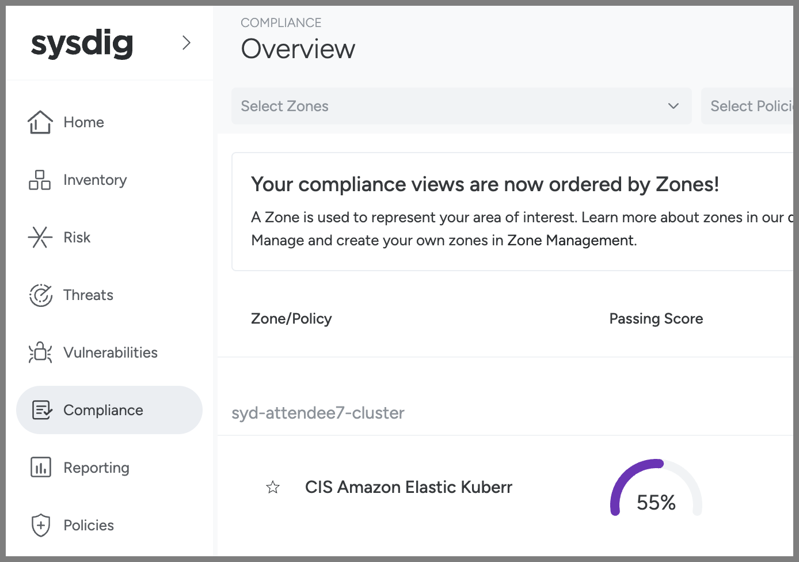
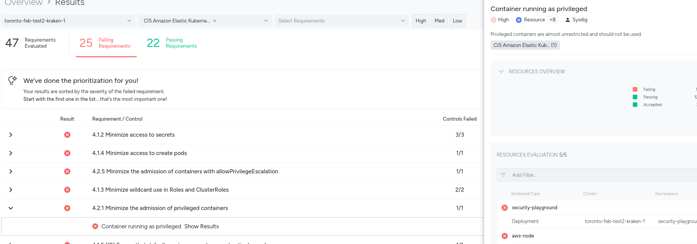
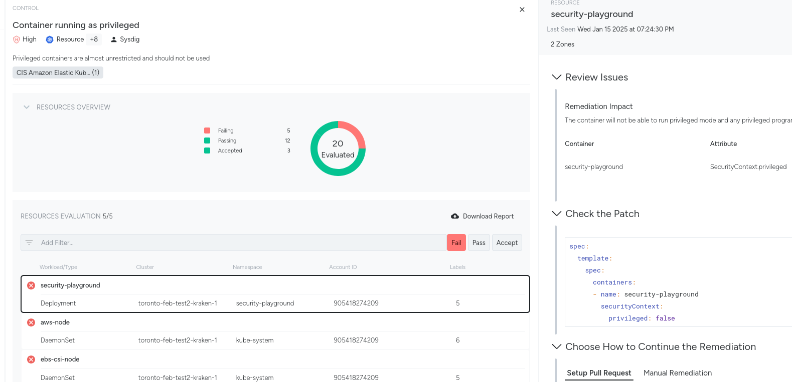
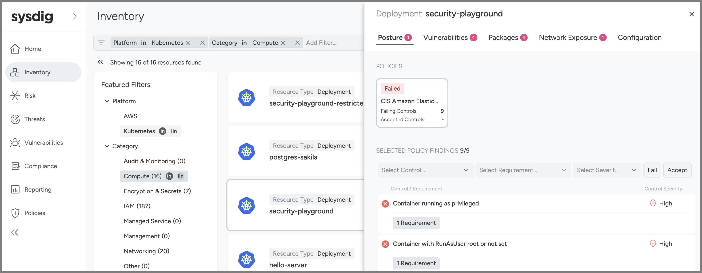
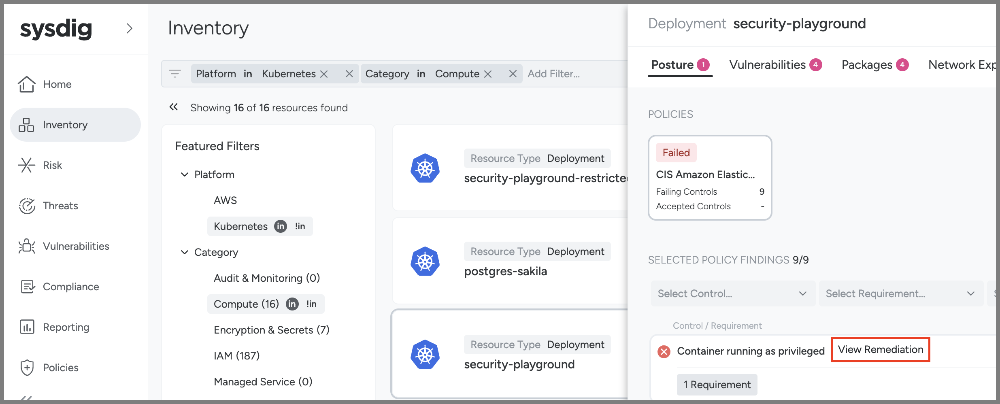
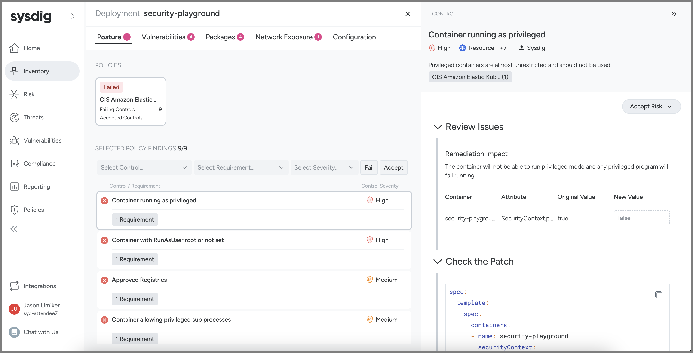
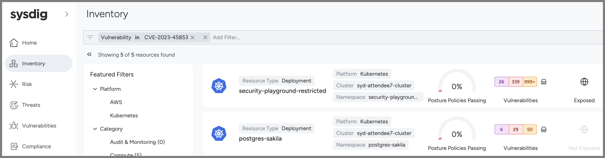

## Module 4 - Kubernetes Posture/Compliance (i.e. fixing misconfigurations)

As we learned in Module 1, it is very important that your Kubernetes/EKS clusters and the workloads on them are properly configured. This is referred to as either Posture or Compliance - as it is about your posture (all of your configuration(s) when taken together) and whether they are compliant with various standards/benchmarks.

Sysdig can ensure you are compliant with many common standards such as CIS, NIST, SOC 2, PCI DSS, ISO 27001 - and many more. To see the whole current list you can go to **Policies** on the left then **Policies** again under the **Posture** heading.

The Center for Internet Security (CIS) publishes a security benchmark for many common resources - including EKS. Learn more at <https://www.cisecurity.org/benchmark/kubernetes>. We'll be looking at your cluster and its workloads to see if they are compliant with that standard in this module.

1. Go to the Sysdig tab in your browser
1. Hover over **Compliance** on the left navigation pane and then click **Overview**
1. We have used our [Team and Zone-based authorization](https://docs.sysdig.com/en/docs/sysdig-secure/policies/zones/) so that your Team can only see your own cluster/Zone.
1. Click on the **CIS Amazon Elastic Kubernetes Service Benchmark** under your heading (this is the only compliance standard we've set against your Zone here - but we have many others such as NIST, SOC2, PCI-DSS, etc.)
    1. 
1. There are some controls here that would have prevented our attack. 
1. If you click into the **Show Results** link for each you'll see the list of failing resources then you can click **View Remediation** next to the **security-playground** Resource to see the Remediation instructions:
    1. 4.2.1 Minimize the admission of privileged containers
        1. Container running as privileged
    2. 4.1.5 Ensure that the default service accounts are not actively used
        1. Access granted to "default" account directly
    3. 
    4. 

If these settings for **security-playground** were configured to be passing CIS' EKS Benchmark, then it would be just like the **security-playground-unprivileged** workload which, as we saw, fared **much** better in our attack.

And, in addition to helping you to remediate any security issues with your workload(s) and cluster(s), this tool will help you to prove to your auditors that they are compliant with any standards you need to adhere to as well.

There is another view of the same data which may prove more useful in many situations - **Inventory**.

This is the same information but from the perspective of the resource rather than from the compliance standard - meaning that the Compliance view is "show me what is passing or failing the standard" whereas the Inventory view is "show me how my resource is doing against the standard(s) applied to it (by the Zone)".

Here we are looking at the security-playground deployment and seeing how it is doing first for its posture.


You can even click through to the same remediation steps right in this view too (hover your mouse over the control to see View Remediation).



Finally, one of the common things we are is "How can I see what workloads have a particular CVE?" This filter is not possible in the Vulnerability section (those filters are more about the workloads than the vulnerabilities) - but it is possible here in Inventory. Put in a filter for **Vulnerability in CVE-2023-45853** as an example.


And, as a reminder, you all are in one Sysdig account but are only seeing your own clusters/workloads. So this is something we can easily restrict via our built-in Authorization (via Zones tied to Teams) so that people will only see as much or as little of the environment in Sysdig as you'd like.

### Scanning your IaC in your pipeline(s) (DevSecOps / Shifting Left)

It is also possible to use the same Sysdig CLI scanner we used to scan for container image vulnerabilities to also scan your Infrastructure as Code (by adding a --iac) to ensure that is secure before deploying it.

In order to do so you can run the following command:

```bash
sudo bash; cd ~
~/sysdig-cli-scanner --apiurl $SYSDIG_SECURE_URL --iac example-scenarios/k8s-manifests/04-security-playground-deployment.yaml
```

You could add this as a stage of a pipeline or as a git merge test where, if the scan failed, it would stop the pipeline/merge until the security misconfigurations were resolved.

Setting up such pipeline scans/gates is often referred to as "shifting left" (further into the development stages/lifecycle) or "DevSecOps".
