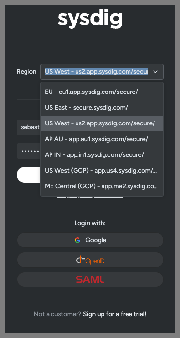

## Before you go

### Get your attendee ID
  
- **CLASS_ID-kraken-XX** (where CLASS_ID is your class ID and where XX is your attendee number at the end of your username) example: `q3y25-us2-kraken-12`

### Get your attendees credentials

- Your instrcutor will provide you with a `.txt` file with some credentials to the AWS console and to access your demo Sysdig account.

### Know your Sysdig region

- 
- Depending on your class, your instructor will let you know which Sysdig region to use:
  - US West
  - EU
  - AP

### Know your AWS region and account

- Depending on your class, your instructor will let you know which AWS region to use:
  - sysdig-kraken-hunter-us (905418274209) -> us-west-1
  - sysdig-kraken-hunter-eu (339712937206) -> eu-central-1
  - sysdig-kraken-hunter-ap (381492038270) -> ap-southeast-2

## Logging into your environment

### AWS Environment

You'll have received your IAM username and password from the facilitator. This environment consists of:

- An EC2 Instance to serve as a "Jumpbox" or Basion host to connect to the environment
  - You'll connect to this via AWS SSM Session Manager via your web browser and the AWS Console
  - It has an AWS IAM role assigned to it with access to your EKS cluster
  - It has all the scripts/commands you'll run in this workshop preinstalled
- A single-Node EKS cluster
  - This has a number of workloads in a number of different Namespaces pre-installed
    - We leverage different Namespaces to show the challenges with multi-tenancy of EKS as well as to apply different Sysdig policies to different workloads (to demonstrate the different ways you can configure those policies and scope them within Sysdig)
- An S3 bucket (which you'll be using to exfiltrate some data in the workshop)


To sign into your environment:

>🚨 Your AWS user is restricted to only be able to access the resources that you need access to in order to complete the workshop. You will see many warnings around lack of permissions, but this is OK as you will still be able to complete the workshop.

1. Open a web browser and go to <https://aws.amazon.com/console/>
2. If prompted, choose to sign in with an IAM user (as opposed to the Root user) and enter the AWS Account ID of ["YOUR_AWS_ACCOUNT_ID section"](#know-your-aws-region-and-account)
3. Enter the IAM username and password you were provided and click the **Sign in** button
4. Pick the ["YOUR_AWS_ACCOUNT_ID section"](#know-your-aws-region-and-account) region in the drop-down in the upper right of the console
    1. 
5. Go to the EC2 service's console (you can type EC2 in the Search box on top and then click on the EC2 service in the results)
6. Click on the **Instances (running)** link under **Resources** to be taken to a list of running EC2 Instances.
    1. 
7. In the **Find instance by attribute or tag** search box type **CLASS_ID-kraken-XX** (where CLASS_ID is your class ID and where XX is your attendee number at the end of your username) and press enter/return.
8. Tick the box next to the jumpbox and then click the **Connect** button on top
    1. 
9. Choose the **Session Manager** tab and then click the **Connect** button.
    1. 
    2. If you dont see the **Connect** button enabled you are probabbly trying to access some other attendee's jumpbox.
10. Once your terminal window opens type:

    ```bash
    sudo bash
    cd ~
    ```

    - As all of our workshop content is pre-installed in the root user's home directory
    - **NOTE:** if you close and re-open the Session Manager Session/Terminal window then you'll need to rerun those two commands to return to the root user and its home directory.
11. Type:

    ```bash
    kubectl get pods -A
    ```

    You'll see a list of all the running Pods in your EKS cluster.

> **NOTE**: Even though we will refer you to a few example files on GitHub throughout the workshop, everything you need to run has already been pre-installed onto the jumpbox in `/root`. You don't need to copy/paste or `git clone` anything from GitHub today.

### Sysdig environment

You'll have received a login and password for Sysdig from the facilitator. To sign into your environment:

1. Open a web browser and go to <https://sysdig.com>
2. Under the Log In dropdown on the top right of the page choose ["YOUR_SYSDIG_ACCOUNT_REGION section"](#know-your-sysdig-region) (US-East, EU-Central, ...) under **Sysdig Secure** (NOTE: not Sysdig Monitor which we won't be looking at today)
    1. 
3. Enter the email address and password you were provided for Sysdig and click the **Log in** button
4. If you see the Customize your Sysdig experience screen, then click the **Get into Sysdig** button in the lower right hand corner to take you through to the **Home** screen
