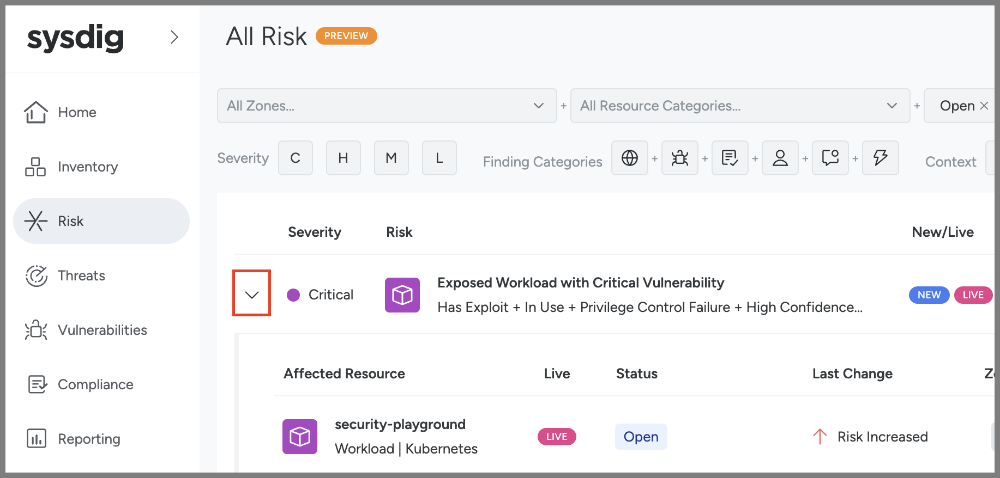
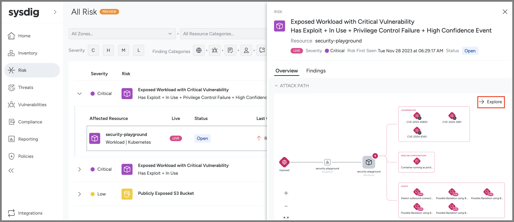
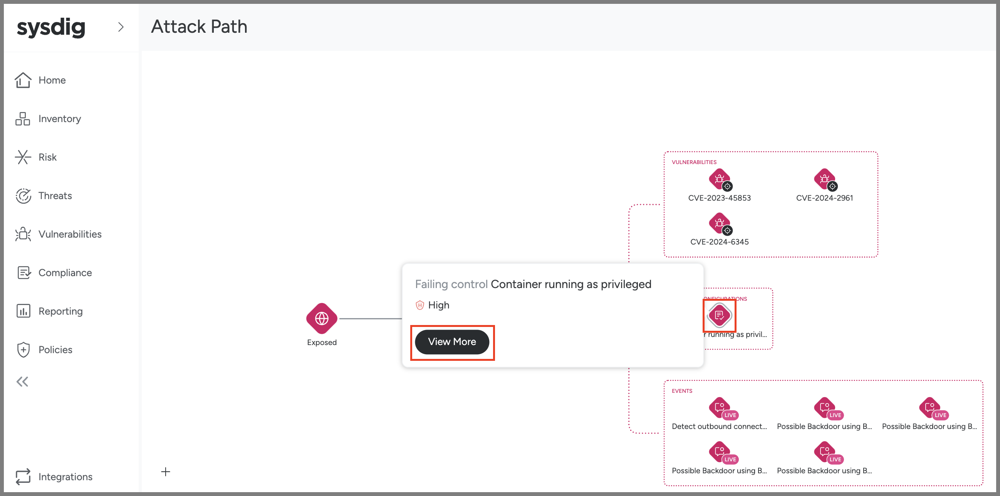
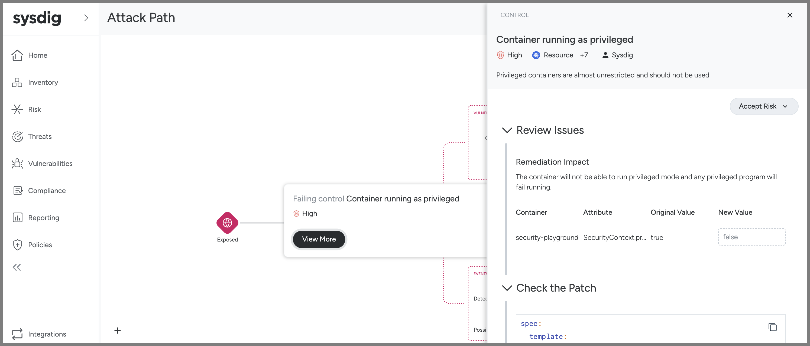

## Risks and Attack Path

So far we explored each of these capabilities (Runtime Threat Detection, Vulnerability Management and Posture Management) separately in their own UIs. But Sysdig is a comprehensive Cloud Native Application Protection Platform (CNAPP) - which means that we bring these all capabilities and all this data together to help you to visualize and prioritise with the full context end-to-end.

Where we do that in the product is in Risks.

If you go to Risks on the left side you'll see this:

You can expand out the carrot to see more details. The fact that we see the Live icon shows that this is an active risk (that not only does it have insecure configurations and/or critical vulnerabilities but we see recent critical Events that these might be getting exploited now). And you see that this includes all of the categories:

- It is exposed (in this case outside the Kubernetes cluster)
- It has critical vulnerabilities
- It has insecure configurations
- And it has events where risky behavior has already been detected

We can drill in even deeper by clicking on it. Here we see a smaller version of the attack path visualisation. Let's see a bigger one by clicking Explore in the upper right:
.

Here you can see all of the data Sysdig has about the security-playground workload but all brought together in one visualisation. And that, while any of these things are bad, the fact that this workload has all of them makes it a Critical Risk to prioritise.

Once we are in the larger Attack Path visualisation we can click on any of the icons to drill down and go deeper into that - and maybe even resolve it right from this UI:

