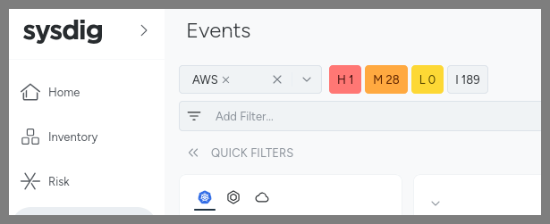
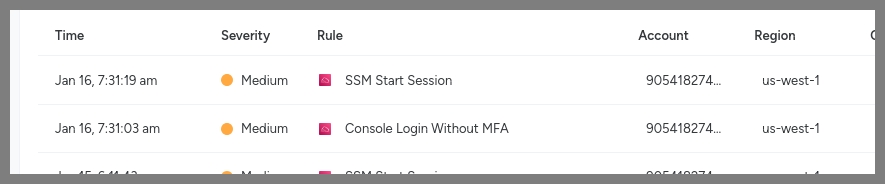

## Runtime Threat Detection and Prevention (Cloud/AWS)

Sysdig's Runtime Threat Detection is not limited to your Linux Kernel Syscalls and Kubernetes Audit trail - it can also do agentless runtime threat detection against AWS CloudTrail (as well as Azure, GCP, Okta, Entra ID and GitHub - with more coming all the time)! When we say agentless, we mean that the Falco watching your CloudTrail is run by Sysdig in our SaaS backend for you. You optionally *could* run an agent in your account called the [Cloud Connector](https://docs.sysdig.com/en/docs/installation/sysdig-secure/connect-cloud-accounts/aws/agent-based-with-ciem/) as well - but most customers now prefer that Sysdig does this for them as-a-service without an agent.

Let's have a quick look at an AWS CloudTrail detection - and why covering both your EKS and AWS environments is important.

### Section 1 - CloudTrail Detections

Now you have logged in with your AWS user. However, you may have noticed that you are not using Multi-Factor Authentication (MFA) to do so. In the real world, you should always use MFA to log in to your AWS account, but in this workshop you don't, simply for ease of use.

But, Sysdig will detect the lack of MFA and alert you on it!

1. Go to **Threats** -> **Events Feed**

2. There, select **AWS** under the **Event Source** filter.



3. In the **Events Feed** pane, you'll see a couple of AWS Cloudtrail alerts. One is for the SSM session where you logged in to your bastion host, and the other is for a login with no MFA.



### Section 2 - AWS IAM Roles for Service Accounts (IRSA)

AWS EKS has a mechanism for giving Pod's access to the AWS APIs called [IAM Roles for Service Accounts (IRSA)](https://docs.aws.amazon.com/eks/latest/userguide/iam-roles-for-service-accounts.html). In short, this binds a particular service account in Kubernetes to an IAM Role in AWS - and will automatically mount credentials for using that AWS IAM role into any Pods that use that Kubernetes service account at runtime.

We've prepared an IRSA mapping already - the **irsa** ServiceAccount in the **security-playground** Namespace is bound to an AWS IAM Role that has the `"Action": "s3:*"` policy applied for an S3 bucket for your Attendee in this account. If you run the command below you'll see an Annotation on the ServiceAccount with the ARN of that IAM Role:

```bash
sudo bash; cd ~
./set-up-irsa.sh
kubectl get serviceaccount irsa -n security-playground -o yaml
```

It has the following in-line policy (check the IAM role in the AWS console) - one which we commonly see which is a `*` for the s3 service (really two to cover the bucket itself as well as the contents). It is properly scoped down to a single bucket Resource, which is better than nothing, but you'll see why a `*` for this service is a bad idea.

```json
{
    "Version": "2012-10-17",
    "Statement": [
        {
            "Action": "s3:*",
            "Resource": "arn:aws:s3:::attendeestack1-bucket83908e77-1d84qdfaymy9u",
            "Effect": "Allow"
        },
        {
            "Action": "s3:*",
            "Resource": "arn:aws:s3:::attendeestack1-bucket83908e77-1d84qdfaymy9u/*",
            "Effect": "Allow"
        }
    ]
}
```

You'll also note that, if you look at the trust relationships of the IAM Role in the AWS Console, you'll see that this role can be only be assumed by the **irsa** ServiceAccount in the **security-playground** Namespace within the EKS cluster that has been assigned this particular unique OIDC provider for AWS IAM to integrate with.

```json
{
    "Version": "2012-10-17",
    "Statement": [
        {
            "Effect": "Allow",
            "Principal": {
                "Federated": "arn:aws:iam::090334159717:oidc-provider/oidc.eks.ap-southeast-2.amazonaws.com/id/25A0C359024FB4B509E838B84988ABB0"
            },
            "Action": "sts:AssumeRoleWithWebIdentity",
            "Condition": {
                "StringEquals": {
                    "oidc.eks.ap-southeast-2.amazonaws.com/id/25A0C359024FB4B509E838B84988ABB0:aud": "sts.amazonaws.com",
                    "oidc.eks.ap-southeast-2.amazonaws.com/id/25A0C359024FB4B509E838B84988ABB0:sub": "system:serviceaccount:security-playground:irsa"
                }
            }
        }
    ]
}
```

#### The Exploit

If we install the AWS CLI into our container at runtime and run some commands we'll see if our Pod has been assigned an IRSA role and they succeed. There is an **02-01-example-curls-bucket-public.sh** file in `/root` - have a look at it

```bash
sudo bash; cd ~
cat 02-01-example-curls-bucket-public.sh
./02-01-example-curls-bucket-public.sh
```

The install of the AWS CLI succeeds but the S3 changes fail as we don't have that access. We have an updated manifest for the security-playground Deployment that will use this **irsa** ServiceAccount instead of the **default** one we have been using. Apply that by running:

```bash
kubectl apply -f 02-cfg-security-playground-irsa.yaml
```

to apply that change. Now re-run:

```bash
./02-01-example-curls-bucket-public.sh
```

and this time they will work!

#### The Sysdig Detections

On the host side you'll see many **Drift Detections** which will include the commands being run against AWS - and which we could have blocked rather than just detected with Container Drift. This is a good reason to not include CLIs like the AWS one in your images as well! 

But on the AWS API side (go to Threats -> Cloud Activity) you'll see that the protections against this bucket being made public were removed as well as the new Bucket Policy (making them public) were subsequently applied as well!


> **NOTE**: As this is all within one region of one AWS account you'll see that, unlike the Kubernetes events, you'll see the events for the other attendees as well. While we do offer a filter based on AWS Tags (in addition to AWS account and region), unfortunately CloudTrail doesn't include the Tags of the resource(s) involved in the trail - and so it isn't currently possible to filter these down with enough granularity where you can only see your own Events. The AWS Tag filter does apply to Inventory/Compliance though.

#### How to prevent this attack / fix this workload

This IRSA example could have been prevented with:

- Being more granular and least-privilege with your IRSA's policy to not use `s3*` and therefore allow the removal of public blocks or applying Bucket Policies (just reading/writing files etc.)
  - This is where things like [Permission Boundaries](https://docs.aws.amazon.com/IAM/latest/UserGuide/access_policies_boundaries.html) and [Service Control Policies (SCPs)](https://docs.aws.amazon.com/organizations/latest/userguide/orgs_manage_policies_scps.html) can be helpful too in ensuring that Roles don't get created that are this over-privileged.
  - 
- Enforcing Container Drift with Sysdig so the AWS CLI isn't able to be downloaded/run at runtime (as long as you also ensure it also isn't in your images)

Either would have prevented it in our example but, ideally, you'd do both things - for extra protection!