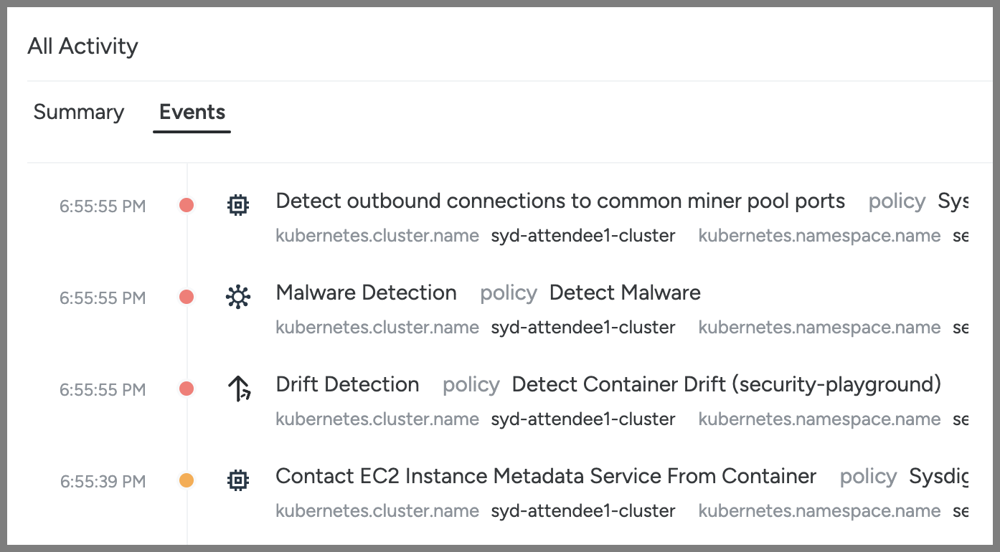
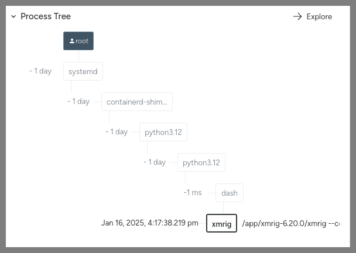

## Runtime Threat Detection and Prevention (Workload/Kubernetes)

In this module, we'll be exploring Sysdig's capabilities around detecting - and even preventing - runtime threats.

Regardless of how an attacker gets in, they will do many of the same things - a predictable sequence of things best explained by the [MITRE ATT&CK Framework](https://attack.mitre.org/). Sysdig's threat research team runs a large fleet of honeypots around the world to learn first-hand all the things people do once they get in - and then continually updates our library of [Rules](https://docs.sysdig.com/en/docs/sysdig-secure/policies/threat-detect-policies/manage-rules/) (possible behaviors to look for) and [Managed Policies](https://docs.sysdig.com/en/docs/sysdig-secure/policies/threat-detect-policies/manage-policies/) (which Rules to look for, their severity, and what to do when we find them) on behalf of all of our customers. You can also make your own custom ([Falco](https://falco.org/)) Rules and/or Policies beyond what we offer if you'd like - this is fully transparent and based on opensource tooling/standards rather than a magic black box!

When Sysdig see these Rules (as defined in the Polices) we generates **Events** with all the relevant context in real-time. And we can do so against these sources - with more coming soon such as from other popular cloud/SaaS services:

- Linux kernel System Calls of your Nodes/Containers
- The Kubernetes Audit Trail
- The audit trails of AWS, Azure and GCP
- Okta's audit trail
- GitHub's audit Trail
- MS Entra ID's audit Trail

In addition to our 'traditional' Rules/Policies-based approach, there are three more features that round out our Threat Detection/Prevention capabilities:

- [Container Drift Detection/Prevention](https://docs.sysdig.com/en/docs/sysdig-secure/policies/threat-detect-policies/manage-policies/drift-control/) - we can look for any executables that are introduced at runtime that were not in the container image as it was pulled - as well as optionally block them from running
- Malware Detection/Prevention (Preview) - we can look for Malware (as defined in several threat feeds we watch) that tries to run - as well as optionally block them from running
- [Crypto Mining ML Detection](https://docs.sysdig.com/en/docs/sysdig-secure/policies/threat-detect-policies/manage-policies/machine-learning/) - we have introduced our first Machine Learning enabled detection with a model specifically focused on detecting crypto-mining.

### Simulating an attack to generate Events within Sysdig

1. In the Sysdig UI hover over **Threats** on the left-hand side and click on Kubernetes under Activity
    1. Pick the six hour time range (6H) on the bottom to show only the events you are about to generate. This should start out as empty.
2. So lets's generate some Events!
    1. Click this link to open the (simple yet insecure) code for the security-playground service on your cluster in a new tab - <https://github.com/sysdiglabs/kraken-hunter-example-scenarios/blob/main/docker-build-security-playground/app.py>
        - This Python app serves a **very** insecure REST API that will return the contents of any file on the filesystem, write any file to the filesystem and/or execute any file on the filesystem in response to simple **curl** commands
            - And you can combine them to download/write a file then execute it for example
        - This is simulating a very bad remote code execution (RCE) vulnerability - which could be either with your own code or in a package it uses (e.g. Log4J, Struts, etc.)
            - As it is detecting what happens when any such vulnerability is being exploited - no matter what or how - that we're interested in here
    2. Go back to the the Session Manager terminal browser tab for your jumpbox
    3. Type

        ```bash
        sudo bash; cd ~
        cat ./01-01-example-curls.sh
        ```

        to have a look at a script with some example **curl** commands we are going to run against the security-playground service:
        1. Reading the sensitive path `/etc/shadow`
        2. Writing a file to `/bin` then `chmod +x`'ing it and running it
        3. Installing **nmap** from **apt** and then running a network scan
        4. Running the **nsenter** command to 'break out' of our container Linux namespace to the host
        5. Running the **crictl** command against the container runtime for the Node (bypassing Kubernetes and the Kubelet to manage it directly)
        6. Using the **crictl** command to grab a Kubernetes secret from another Pod on the same Node (that was decrypted to an environment variable there at runtime)
        7. Using the **crictl** command to run the Postgres CLI **psql** within another Pod on the same Node to exfiltrate some sensitive data
        8. Using the Kubernetes CLI **kubectl** to launch another nefarious workload (leveraging our over-provisioned Kubernetes ServiceAccount that for security-playground)
        9. Running a **curl** command against the AWS EC2 Instance Metadata endpoint for the Node from the security-playground Pod
        10. Finally run the xmrig crypto miner
    4. Go ahead and run that script by typing:

        ```bash
        ./01-01-example-curls.sh
        ```

        and watch all the output that is returned from the attacker's perspective
    5. Note that the Pod is actually killed a little while into the mining triggered by the last curl because the crypto miner (xmrig) tries to use more memory than the limit set for this container (showing another reason it is a good idea to place such limits in your PodSpecs!)
    6. Then go back to the Sysdig UI tab and refresh that tab in your browser
        1. You'll see a circular visualisation/heatmap of which clusters, namespaces and Pods the runtime events we've seen are coming from on the left
        2. And it also gives you either a summary of those events in the **Summary** tab or a full timeline of them in the **Events** tab on the right
        
    7. Choose the Events tab on the right
    8. As you can see there are a number of events that Sysdig picked up here - in real-time!
        1. 
    9. If you click into the the top **Detect crypto miners using the Stratum protocol** and then scroll through it you'll see all the context of that event including details of the process, the network, the AWS account, the Kubernetes cluster/namespace/deployment, the host as well as the container
       1. In particular the process tree view shows us that our Python app (gunicorn) launched a shell that launched the crypto miner xmrig - that looks suspicious!
        
       2. You can also click Explore in order to see a more detailed view of this process tree and the history within this environment
        
       3. Not only does this view show us all the other Events related to this executable (xmrig) on the right, it shows us all the other things that have been happening - the apt-get's, nmap, nsenter's, etc.
        
3. Understanding these Events
    1. You should scroll down to the oldest/first Event then click into each to reveal all the detail/context of each. The things that we picked up here include:
        1. **Read sensitive file untrusted** - reading the `/etc/shadow` file which a web service shouldn't be doing
        2. **Drift Detection** - every time an executable was added to the container at runtime (it wasn't in the image) and then it was run
            - It is not best practice to make changes to containers at runtime - rather you should build a new image and redeploy the service in an immutable pattern
        3. **Launch Package Management Process in Container** - just like with **Drift Detection**, you shouldn't be adding or updating packages in running containers with apt/yum/dnf - but instead do it in your **Dockerfile** as part of the container image build process
        4. **Suspicious network tool downloaded and launched in container** - it is a common early step for attackers to run a scan to try to work out what network the workload they've exploited is in, and thus, what else they can get to
        5. **The docker client is executed in a container** - this fires not just on the **docker** CLI but also other container CLIs such as **crictl** and **kubectl**.
            - It is unusual for a container to be trying to talk directly to the container runtime/socket on a Kubernetes cluster - and that you can is actually proof a container escape has happened!
            - Note that if you expand out the Process section it'll show the commands that were run such as that `psql` that was exfiltrating our data
            - 
        6. **Contact EC2 Instance Metadata Service From Container** - your EKS Pods should be using other means such as [IAM Roles for Service Accounts (IRSA)](https://docs.aws.amazon.com/eks/latest/userguide/iam-roles-for-service-accounts.html) to interact with AWS. It going through the Node to use its credentials instead is suspicious
        7. **Malware Detection** - we look for many malware filenames and hashes from our threat feeds - including crypto miners such as the **xmrig** here
            - We can even block malware from running - as you'll see later on!
        8. **DNS Lookup for Miner Pool Domain Detected** - we look at network traffic (at Layer 3) and when the destination are suspicious things like crypto miner pools or [Tor](https://www.torproject.org/) entry nodes

And this is only a small sample of the Rules we have out-of-the-box as part of the service!

(Optional) Feel free to copy `01-01-example-curls.sh` to a new file and play with generating your own curls if you want to see whether Sysdig will pick up various other things you may want to try!

(Optional) Have a look at all our Managed Policies (go to **Policies** on the left and then **Runtime Policies**) as well as our Rules Library (go to **Policies** then expand out the **Rules** carrot menu and choose **Rules Library**). Drill down into the Falco YAML (noting that this is not a "magic black box" and you can write your own Rules and Policies). Focus on the Policies and Rules that you saw fire in our example.

### Why did this attack work?

In order for this attack to succeed many things had to be true:

1. Our service was vulnerable to remote code execution - this could be either due to our own code being vulnerable (as was the case here) or an opensource package our app uses (from pip, npm, maven, nuget, etc.) being vulnerable
2. Our service that we were **curl**'ing was running as **root** - so, not only could it read/write everything within the container's filesystem, but it was also root when it escaped out of the container to the host!
3. The PodSpec had [**hostPID: true**](https://github.com/sysdiglabs/kraken-hunter-example-scenarios/blob/3da34f8429bd26b82a3ee2f052d2b654d308990f/k8s-manifests/04-security-playground-deployment.yaml#L18) as well as [privileged **securityContext**](https://github.com/sysdiglabs/kraken-hunter-example-scenarios/blob/3da34f8429bd26b82a3ee2f052d2b654d308990f/k8s-manifests/04-security-playground-deployment.yaml#L35) which allowed it to escape its container boundary (the Linux namespace it was being run in) to the host and then control that hosts's container runtime (bypassing Kubernetes and the [kubelet](https://kubernetes.io/docs/concepts/overview/components/#kubelet)). That in turn lets it control all the other containers that happened to be running on that Node. 
    1. The `nsenter` command lets us switch Linux namespaces - which containers use to isolate us from the other containers. We can only successfully run this if we are root, have hostPID as well as a privileged security context.
    2. The `crictl` command is like the Docker CLI but for containerd (which is the container runtime used these days by Kubernetes Nodes). We can only successfully run this if we are root as well as on the host (such as breaking out with nsenter).
4. The attacker was able to add new executables like `nmap` and the crypto miner `xmrig` to the container at runtime and run them
5. The attacker was able to download those things from the Internet (because this Pod was able to reach everywhere on the Internet via its egress)
6. The ServiceAccount for our service was over-provisioned and could call the K8s API to do things like launch other workloads (which it didn't need).
    - Run:

        ```bash
        kubectl get rolebindings -o yaml -n security-playground && kubectl get roles -o yaml -n security-playground
        ```

         to see that the default ServiceAccount has a Role bound to it with it with the following rules/permissions:

        ```yaml
        rules:
        - apiGroups:
            - '*'
            resources:
            - '*'
            verbs:
            - '*'
        ```

    - At least it was a Role rather than a ClusterRole - meaning it can only do things with this **security-playground** Namespace. But there is plenty of damage you can do with just full admin within a Namespace!
7. The attacker was able to reach the EC2 Metadata endpoint (`169.254.0.0/16`),  which is intended just for the EKS Node, from within the Pod

These are all things we can fix:

- Some with how our workload is configured (which Kubernetes can now enforce for us with the new [Pod Security Admission](https://kubernetes.io/docs/concepts/security/pod-security-admission/))
- Some with Sysdig Secure's Container Drift prevention
- And the rest with controlling egress network access to the Internet

And, if we do all three, then we could have prevented the **entire** attack (rather than just detecting it) - even with the workload in question *still* having this critical remote code execution vulnerability (which we should also fix too)!

### How to fix this workload (security-playground)

For each of the causes above - these are the solutions:

1. To fix the vulnerabilities in our case here, we can use a Static application security testing (SAST) product to identify our insecure code. Our partners like [Snyk](https://snyk.io/product/snyk-code/) and [Checkmarx](https://checkmarx.com/cxsast-source-code-scanning/) can help here.
    1. 
    1. Alternatively, if this was based on a known/public CVE within the app/container (such as Log4J etc.) instead, Sysdig's Vulnerability Management (which we'll explore in a future Module) would have detected it and let us know to patch either the base layer of our container or the code package to an updated version without the vulnerability
1. In order to run this container as non-root we actually need to change the Dockerfile in the following ways. Here is the [Dockerfile](https://github.com/sysdiglabs/kraken-hunter-example-scenarios/blob/main/docker-build-security-playground/Dockerfile) before these changes - and [here](https://github.com/sysdiglabs/kraken-hunter-example-scenarios/blob/main/docker-build-security-playground/Dockerfile-unprivileged) it is after.
    1. We need to [add a user and group to use](https://github.com/sysdiglabs/kraken-hunter-example-scenarios/blob/main/docker-build-security-playground/Dockerfile-unprivileged#L3) as part of the docker build
    1. We need to [specify in the Dockerfile to run as that User by default](https://github.com/sysdiglabs/kraken-hunter-example-scenarios/blob/main/docker-build-security-playground/Dockerfile-unprivileged#L8) (note this is just the default and can be overridden at runtime - unless a restricted PSA or other admission controller blocks that)
    1. We need to put our app in a folder that user/group has permissions to read and execute (and perhaps write to as well) - [in this case we use our new user's home directory](https://github.com/sysdiglabs/kraken-hunter-example-scenarios/blob/main/docker-build-security-playground/Dockerfile-unprivileged#L9) as opposed to the original /app
    1. There was a great talk about building least privilege containers from the recent KubeCon Europe that goes much deeper here - <https://youtu.be/uouH9fsWVIE>
1. We just need to remove the insecure options from our PodSpec. But we also need to, ideally, prevent people from putting those sorts of options in them as well.
    1. There is now a feature built-in to Kubernetes (which GAed in 1.25) to enforce that they don't - [Pod Security Admission](https://kubernetes.io/docs/concepts/security/pod-security-admission/).
        1. This works by [adding labels onto each Namespace](https://kubernetes.io/docs/tasks/configure-pod-container/enforce-standards-namespace-labels/). There are two standards that it can warn about and/or enforce for you - baseline and restricted.
            1. [baseline](https://kubernetes.io/docs/concepts/security/pod-security-standards/#baseline) - this prevents the worst of the parameters in the PodSpec such as hostPid and Privileged but still allows the container to run as root
            1. [restricted](https://kubernetes.io/docs/concepts/security/pod-security-standards/#restricted) - this goes further and blocks all insecure options including running as non-root
    1. And Sysdig has a Posture/Compliance feature that can help both catch the IaC before it is deployed as well as remediate any issues at runtime - which we'll look at in a future Module.
1. We can block the execution of any new scripts/binaries added at runtime with Container Drift (in this case we only had it detecting not preventing Drift)
1. We can limit the egress access of Pod(s) to the Internet via either Kubernetes NetworkPolicy (which we cover in a future Module) or by making each thing go through an explicit authenticated proxy to reach the Internet with an allow-list of what that service is able to reach etc.
1. We can remove the Role and RoleBinding to the Kubernetes API by our default ServiceAccount that lets it have unnecessary access to to the Kubernetes API.
1. We can either block egress access for the Pod to `169.254.0.0/16` via NetworkPolicy as described above and/or ensure a maximum of 1 hop with IDMSv2 as AWS describes in their documentation - <https://docs.aws.amazon.com/whitepapers/latest/security-practices-multi-tenant-saas-applications-eks/restrict-the-use-of-host-networking-and-block-access-to-instance-metadata-service.html>

### Seeing the fixes in action

We have an example workload where 1-3 of **Why did this attack work** have been fixed running as well - **security-playground-unprivileged**. It was built with our new non-root Dockerfile and it is running in the security-playground-restricted Namespace where a PSA is enforcing a restricted security standard (meaning it can't run as root or have the options such as hostPID or privileged SecurityContext to allow for container escapes). You can see the labels on this namespace implementing the PSA by running `kubectl describe namespace security-playground-restricted` - note the **pod-security** Labels.

You can see the original Kubernetes PodSpec [here](https://github.com/sysdiglabs/kraken-hunter-example-scenarios/blob/main/k8s-manifests/04-security-playground-deployment.yaml) and the updated one with all the required changes to pass the restricted PSA [here](https://github.com/sysdiglabs/kraken-hunter-example-scenarios/blob/main/k8s-manifests/07-security-playground-restricted-deployment.yaml).

To see how our attack fares with 1-3 fixed run:

 ```bash
 ./01-02-example-curls-restricted.sh
 ```

(it is the same as the last file just pointed at the different port/service for security-playground-restricted). You'll note:

- Anything that required root within the container (reading `/etc/shadow`, writing to `/bin`, installing packages from apt, etc.) fails with a **500 Internal Server Error** because our Python app didn't have permissions to do it.
- Without **root**, **hostPid** and **privileged** it couldn't escape the container
- The only things that worked were hitting the Node's EC2 Metadata endpoint and downloading/running the xmrig crypto miner into the user's home directory (where it still had rights to do so.)

If we also add in Sysdig enforcing that any Container Drift is prevented (that no new executables added at runtime can be run), then that blocks *everything* but the EC2 Instance Metadata access (which we'll block with NetworkPolicies in a future Module). To see that:

- Go to **Policies** -> **Runtime Policies** and then look at **security-playground-restricted-nodrift** - Note that rather than just detecting drift (as in the other Namespaces) we are blocking it if the workload is in the **security-playground-restricted-nodrift** Namespace
  - And we have a another copy of our security-playground-restricted service running there on a different HostPort
- Run:

    ```bash
    ./01-03-example-curls-restricted-nodrift.sh 
    ```

    which runs all those same curls but against a workload that is both restricted like the last example but also has Sysdig preventing Container Drift (rather than just detecting it)
    1. If you look at the resulting Events in our Threats UI you'll see the Drift was **prevented** rather than just detected this time
    2. 

And, we also can now block instead of just detecting Malware.
To see that:

- Go to **Policies** -> **Runtime Policies** and then look at **security-playground-restricted-nomalware** - Note that rather than just detecting malware (as in the other Namespaces) we are blocking it if the workload is in the **security-playground-restricted-nomalware** Namespace
  - And we have a another copy of our security-playground-restricted service running there on a different HostPort
- Run:

    ```bash
    ./01-04-example-curls-restricted-nomalware.sh
    ```

    which runs all those same curls but against a workload that is both restricted but also has Sysdig preventing malware (rather than just detecting it) (but not blocking Container Drift - as we want to show that the malware tries to run so we can block it with that)
    1. If you look at the resulting Events in our Threats UI you'll see the Malware was **prevented** from running rather than just detected this time
    2. 

So, as you can see, a combination of fixing the posture of the workload as well as Sysdig's Container Drift and Malware Detection goes a **long** way to preventing so many common attacks - even against workload with such critical vulnerabilities!

One last thing you can try is to test trying to change security-playground-restricted to undermine its security like security-playground. Run the following command to try to deploy the insecure container image and PodSpec to that namespace:

```bash
kubectl apply -f 01-cfg-security-playground-test.yaml
```

Note how we're warned that is not allowed in the **security-playground-restricted** Namespace due to the restricted PSA in place there. Even though it let the Deployment create - you'll note that it (actually its ReplicaSet) is unable to actually launch the Pods.


Run

```bash
kubectl events security-playground -n security-playground-restricted
```

to see the Pod creation failures.

This is why blocking at runtime with PSAs are a bit of a blunt instrument - you should also let people know earlier/lefter in the pipeline that this is going to happen (and they need to fix the PodSpecs) rather than have them scratch their head on why their pods are not launching at run/deploy time.

This table summarises our experiments in fixing this workload:

|Exploit in the example-curl.sh|example-curl|security-playground|security-playground-restricted|security-playground-restricted + container drift enforcement|security-playground-restricted + malware enforcement|
|-|-|-|-|-|-|
|1|Reading the sensitive path /etc/shadow|allowed|blocked (by not running as root)|blocked (by not running as root)|blocked (by not running as root)|
|2|Writing a file to /bin then chmod +x'ing it and running it|allowed|blocked (by not running as root)|blocked (by not running as root)|blocked (by not running as root)|
|3|Installing nmap from apt and then running a network scan|allowed|blocked (by not running as root)|blocked (by not running as root)|blocked (by not running as root)|
|4|Running the nsenter command to 'break out' of our container Linux namespace to the host|allowed|blocked (by not running as root and no hostPID and no privileged securityContext)|blocked (by not running as root and no hostPID and no privileged securityContext)|blocked (by not running as root and no hostPID and no privileged securityContext)|
|5|Running the crictl command against the container runtime for the Node|allowed|blocked (by not running as root and no hostPID and no privileged securityContext)|blocked (by not running as root and no hostPID and no privileged securityContext)|blocked (by not running as root and no hostPID and no privileged securityContext)|
|6|Using the crictl command to grab a Kubernetes secret from another Pod on the same Node|allowed|blocked (by not running as root and no hostPID and no privileged securityContext)|blocked (by not running as root and no hostPID and no privileged securityContext)|blocked (by not running as root and no hostPID and no privileged securityContext)|
|7|Using the crictl command to run the Postgres CLI psql within another Pod on the same Node to exfiltrate some sensitive data|allowed|blocked (by not running as root and no hostPID and no privileged securityContext)|blocked (by not running as root and no hostPID and no privileged securityContext)|blocked (by not running as root and no hostPID and no privileged securityContext)|
|8|Using the Kubernetes CLI kubectl to launch another nefarious workload|allowed|blocked (by ServiceAccount not being overprovisioned)|blocked (by ServiceAccount not being overprovisioned and Container Drift Enforcement preventing kubectl being installed)|blocked (by ServiceAccount not being overprovisioned)|
|9*|Running a curl command against the AWS EC2 Instance Metadata endpoint for the Node from the security-playground Pod|allowed|allowed|allowed|allowed|
|10|Run the xmrig crypto miner|allowed|allowed|blocked (by Container Drift Enforcement blocking xmrig from being installed)|blocked (by Malware Enforcement)|

*And 9 can be blocked by NetworkPolicy and/or limitations of IDMSv2 to 1 hop. We'll do that in the future NetworkPolicy Module.