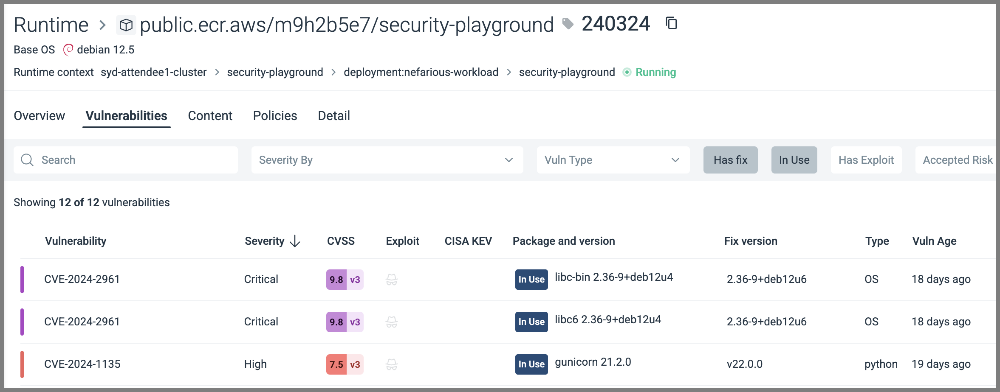
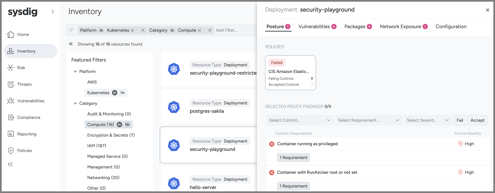
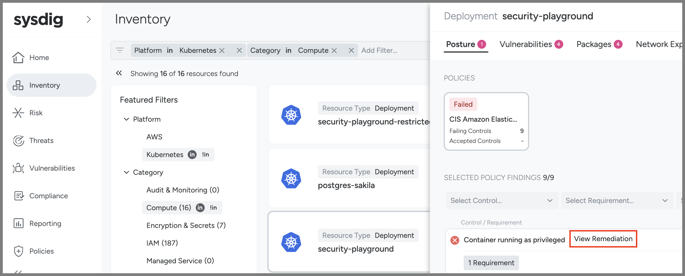
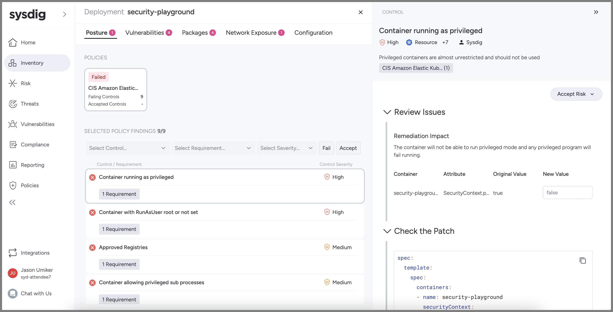
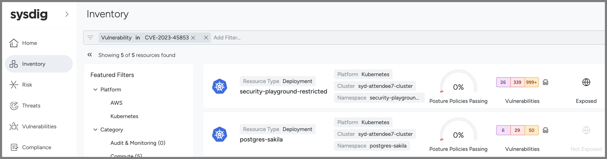

## Module 3 - Host and Container Vulnerability Management

Sysdig has an integrated solution for both (Linux) host as well as container vulnerabilities which scans for known CVEs in your pipelines, your registries as well as at runtime. And, when when we do it at runtime, the added context we bring to it really can help you to route and prioritise things!

### Runtime Vulnerability Scanning

To explore Sysdig's runtime vulnerability scanning:

1. Go to the Sysdig browser tab and go to **Vulnerabilities** on the left and then **Runtime** under Findings.
    - This is a list of all of the running containers in your environment within the last 15 minutes as well as all the hosts/Nodes that our agent is installed on
    - It is automatically sorted by severity for you - so the container image on top is the most important to fix (based on the quantity and severity of the In Use vulnerabilities)
    
2. Click on the top container/vulnerability and then examine the top you'll see:
    - The image and tag in question - we know this is running now
    - The runtime context including the deployment, namespace and cluster it is running on - this is often useful in routing the remediation work to the right team(s)
    
3. Click the **Vulnerabilities** tab - this is a list of all of the Vulnerabilities we found in the image
    
4. Click on one of the CVEs and note all of our details on where we learned about this vulnerability and any fixes or known exploits we know for it
  
5. Close that vulnerability detail pane
6. Click on the **In Use** filter button - this excludes all the vulnerabilities that we have never seen run (and therefore are much less likely to be exploitable).
7. Click on the **Has fix** button - this excludes those vulnerabilities that do not yet have a new version with a fix available (and therefore your team can't patch them yet)
    - What we are left with is those vulnerabilities that are actually running (not just in the image) **and** for which there is a fix. This is a more reasonable and prioritized patching task to give somebody!
    

### Pipeline vulnerability scanning

To scan container images for vulnerabilities before they hit a registry, much less a running environment, we have our command-line scanning tool. This can be run anywhere from a developer laptop to a pipeline. If a scan fails (and it is configurable by granular policies under what conditions it'll pass vs. fail) our return code will be non-zero so your pipeline can, in turn, fail that stage until it is fixed.

Here are the instructions for how to install and run our vulnerability CLI scanner - <https://docs.sysdig.com/en/docs/installation/sysdig-secure/install-vulnerability-cli-scanner/>.

We have already installed it on your jumpbox for you. You can run a scan of the image `logstash:7.16.1` which is an image that has Log4J in it by running the following command:

```bash
sudo bash; cd ~
~/sysdig-cli-scanner -a $SYSDIG_SECURE_URL logstash:7.16.1
```

Not only do you get that output into your build logs for the pipeline stage, but you can also explore the results the Sysdig SaaS UI by following that link listed in the output or going to **Vulnerabilities** -> **Pipeline** in the UI. Note that this is missing the runtime context (as, since it was scanned in a pipeline, and we don't yet know that runtime context).

We also have the [capability to scan images in your registries](https://docs.sysdig.com/en/docs/installation/sysdig-secure/install-registry-scanner/) - but we won't explore that in this workshop.

## Module 4 - Kubernetes Posture/Compliance (i.e. fixing misconfigurations)

As we learned in Module 1, it is very important that your Kubernetes/EKS clusters and the workloads on them are properly configured. This is referred to as either Posture or Compliance - as it is about your posture (all of your configuration(s) when taken together) and whether they are compliant with various standards/benchmarks.

Sysdig can ensure you are compliant with many common standards such as CIS, NIST, SOC 2, PCI DSS, ISO 27001 - and many more. To see the whole current list you can go to **Policies** on the left then **Policies** again under the **Posture** heading.

The Center for Internet Security (CIS) publishes a security benchmark for many common resources - including EKS. Learn more at <https://www.cisecurity.org/benchmark/kubernetes>. We'll be looking at your cluster and its workloads to see if they are compliant with that standard in this module.

1. Go to the Sysdig tab in your browser
1. Hover over **Compliance** on the left navigation pane and then click **Overview**
1. We have used our [Team and Zone-based authorization](https://docs.sysdig.com/en/docs/sysdig-secure/policies/zones/) so that your Team can only see your own cluster/Zone.
1. Click on the **CIS Amazon Elastic Kubernetes Service Benchmark** under your heading (this is the only compliance standard we've set against your Zone here - but we have many others such as NIST, SOC2, PCI-DSS, etc.)
    1. 
1. There are some controls here that would have prevented our attack. 
1. If you click into the **Show Results** link for each you'll see the list of failing resources then you can click **View Remediation** next to the **security-playground** Resource to see the Remediation instructions:
    1. 4.2.1 Minimize the admission of privileged containers
        1. Container running as privileged
    2. 4.1.5 Ensure that the default service accounts are not actively used
        1. Access granted to "default" account directly
    3. 
    4. 

If these settings for **security-playground** were configured to be passing CIS' EKS Benchmark, then it would be just like the **security-playground-unprivileged** workload which, as we saw, fared **much** better in our attack.

And, in addition to helping you to remediate any security issues with your workload(s) and cluster(s), this tool will help you to prove to your auditors that they are compliant with any standards you need to adhere to as well.

There is another view of the same data which may prove more useful in many situations - **Inventory**.

This is the same information but from the perspective of the resource rather than from the compliance standard - meaning that the Compliance view is "show me what is passing or failing the standard" whereas the Inventory view is "show me how my resource is doing against the standard(s) applied to it (by the Zone)".

Here we are looking at the security-playground deployment and seeing how it is doing first for its posture.


You can even click through to the same remediation steps right in this view too (hover your mouse over the control to see View Remediation).



Finally, one of the common things we are is "How can I see what workloads have a particular CVE?" This filter is not possible in the Vulnerability section (those filters are more about the workloads than the vulnerabilities) - but it is possible here in Inventory. Put in a filter for **Vulnerability in CVE-2023-45853** as an example.


And, as a reminder, you all are in one Sysdig account but are only seeing your own clusters/workloads. So this is something we can easily restrict via our built-in Authorization (via Zones tied to Teams) so that people will only see as much or as little of the environment in Sysdig as you'd like.

### Scanning your IaC in your pipeline(s) (DevSecOps / Shifting Left)

It is also possible to use the same Sysdig CLI scanner we used to scan for container image vulnerabilities to also scan your Infrastructure as Code (by adding a --iac) to ensure that is secure before deploying it.

In order to do so you can run the following command:

```bash
sudo bash; cd ~
~/sysdig-cli-scanner --apiurl $SYSDIG_SECURE_URL --iac example-scenarios/k8s-manifests/04-security-playground-deployment.yaml
```

You could add this as a stage of a pipeline or as a git merge test where, if the scan failed, it would stop the pipeline/merge until the security misconfigurations were resolved.

Setting up such pipeline scans/gates is often referred to as "shifting left" (further into the development stages/lifecycle) or "DevSecOps".
